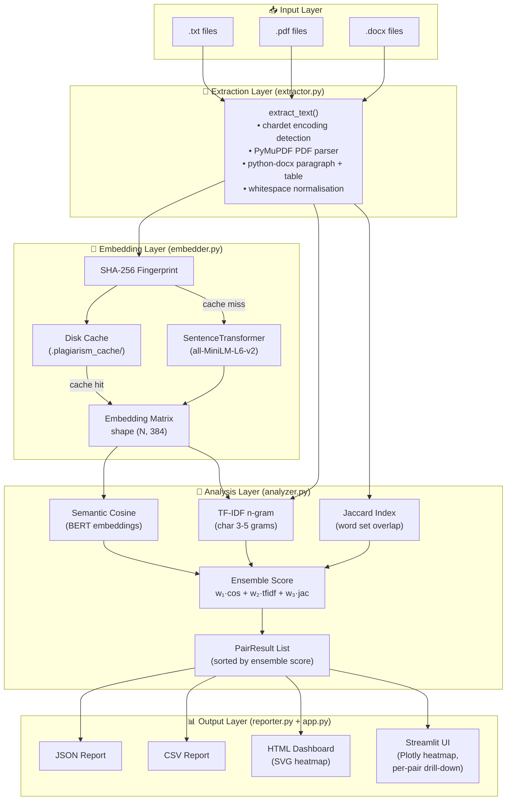
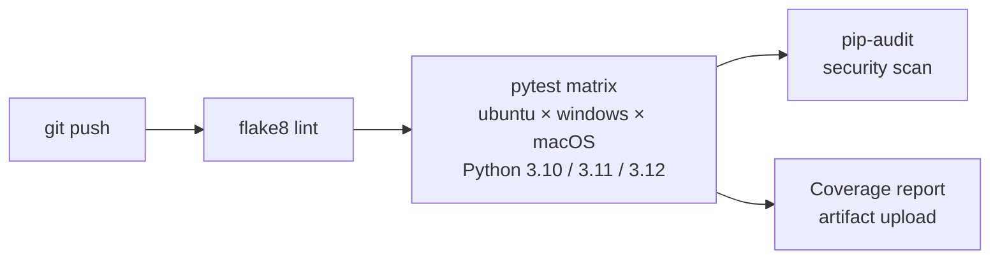

# Architecture — PlagiarismIQ

## System Overview



---

## Component Deep-Dives

### `extractor.py` — Text Extraction

```
extract_text(path)
    ├── .txt  → chardet → read_bytes → decode(encoding)
    ├── .pdf  → fitz.open() → page.get_text() per page
    └── .docx → docx.Document → paragraphs + table cells
                      ↓
               _normalise() → collapse whitespace → strip
```

**Key decisions:**
- Lazy imports for `fitz` and `docx` — tests don't need these installed
- `chardet` fallback — handles non-UTF-8 legacy documents gracefully
- Table cell extraction in DOCX — naive extractors miss table content

---

### `embedder.py` — Semantic Embedding Engine

```
EmbeddingEngine(model_name, cache_dir)
    ├── encode(texts)
    │       ├── for each text → fingerprint = SHA-256(model::text)
    │       ├── cache hit  → load .npy file
    │       └── cache miss → batch encode uncached → save .npy
    └── encode_one(text) → single document path
```

**Cache design:**
- One `.npy` file per (model, text) fingerprint
- Partial-batch caching: only uncached documents hit the model
- Corrupt cache files are silently deleted and re-encoded

---

### `analyzer.py` — Ensemble Similarity Scoring

```
SimilarityAnalyzer(weights=(0.55, 0.30, 0.15), threshold=0.75)
    └── analyze(names, texts, embeddings)
            ├── semantic_matrix = cosine_similarity(embeddings)
            ├── tfidf_matrix    = TfidfVectorizer(char_wb, 3-5) → cosine
            └── for each pair (i, j):
                    jaccard    = |word_set(i) ∩ word_set(j)| / |∪|
                    ensemble   = w₁·sem + w₂·tfidf + w₃·jac
                    → PairResult(doc_a, doc_b, scores…)
```

**Why three algorithms?**

| Scenario | Semantic | TF-IDF | Jaccard |
|---|---|---|---|
| Verbatim copy | ✅ | ✅ | ✅ |
| Sentence shuffle | ✅ | ✅ | ✅ |
| Synonym substitution | ✅ | ❌ | ❌ |
| Structural rewrite | ✅ | ❌ | ❌ |
| Short documents | ❌ | ✅ | ✅ |

The ensemble catches all cases no single algorithm can handle alone.

---

### `reporter.py` — Report Generation

```
ReportWriter
    ├── to_json()  → structured JSON (summary + pairs + documents)
    ├── to_csv()   → RFC 4180 CSV with header row
    └── to_html()  → standalone HTML
                        ├── Inline CSS (dark theme, no CDN)
                        ├── SVG heatmap (pure SVG, no JS)
                        └── Pair result table with score bars
```

The HTML report is **fully self-contained** — no internet connection required to render it.

---

## Data Models

```python
@dataclass
class PairResult:
    doc_a: str
    doc_b: str
    semantic_score: float   # [0, 1]
    tfidf_score:    float   # [0, 1]
    jaccard_score:  float   # [0, 1]
    ensemble_score: float   # [0, 1]
    text_a_length:  int     # word count
    text_b_length:  int     # word count
    risk_level:     str     # computed property
```

---

## CI/CD Pipeline



**Matrix:** 3 OS × 3 Python versions = **9 test environments** per push.
